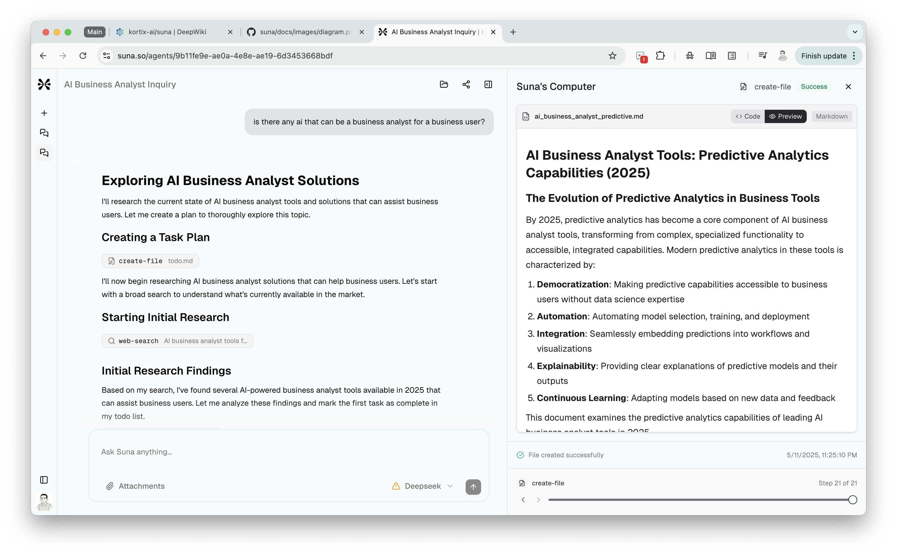

## Background

For context, I already know about [manus ai](https://manus.im/), an AI agent that feel like an AGI, which can help human to do any task it needs. It become viral when it is first released.


Then for about a week ago, I saw another AI agent called [suna](https://www.suna.so/), which I believe is the same as manus, but it is open source.


So I really curious on how they work, so I open the source code and try to understand how they work. Fortunately, they use _nextjs_ and _fastapi_ as their tech stack, which is something that I am familiar with.


After directly trying the apps, I feel like I have another idea for mark. I can mimic on how agentic AI works on suna, but specialized for business analyst. Because I strongly believe, as my experience as a data scientist, the question that the user ask is not always can answer on one shot. But sometimes, there is a loop of question and answer by myself, until it is ready to answer the question to the user. For instance, the question could be like: _"My A product declining for the last 3 months, what is the reason and how to resolve it?"_. Answer those question, can not be done on one shot. Instead, it need to make a plan, reading and evaluating the data we receive, make a diagnosis, and make an assessment whether the answer is ready to answer the question to the user. Therefore, it need agentic AI to do that, which could manage the loop of question and answer. Not just a simple chatbot.

## Process

### Understanding the source code

To understand the source code, the first thing to do, is to try to host the app to my local machine. Fortunately, they already provide the step on their `README.md` file. You can directly follow along the step on [their repository](https://github.com/kortix-ai/suna). But apparently, it is far more time consuming that I expected. I have to not only install the dependencies, but also need to get an API key for each third party service it used, and also solve error that is not managed by the documentation it self.

After I finally host the app, I try to understand the code.

```bash
.
├── backend
│   ├── __pycache__
│   ├── agent
│   ├── agentpress
│   ├── api.py
│   ├── docker-compose.yml
│   ├── Dockerfile
│   ├── fly.production.toml
│   ├── fly.staging.toml
│   ├── logs
│   ├── MANIFEST.in
│   ├── poetry.lock
│   ├── pyproject.toml
│   ├── README.md
│   ├── requirements.txt
│   ├── sandbox
│   ├── services
│   ├── supabase
│   └── utils
├── docker-compose.ghcr.yaml
├── docker-compose.yaml
├── docs
│   └── images
├── frontend
│   ├── components.json
│   ├── Dockerfile
│   ├── eslint.config.mjs
│   ├── next-env.d.ts
│   ├── next.config.ts
│   ├── node_modules
│   ├── package-lock.json
│   ├── package.json
│   ├── postcss.config.mjs
│   ├── public
│   ├── README.md
│   ├── src
│   └── tsconfig.json
├── LICENSE
├── README.md
└── supabase
```

I remember that delvin have [deepwiki](https://docs.devin.ai/work-with-devin/deepwiki). Which is a tool that can help you to understand the codebase of your project. Which help me a lot to understand the [codebase of suna](https://deepwiki.com/kortix-ai/suna). From that point, I learn how the agentic AI works on suna, from the client interact with the frontend, to the backend, and how they manage thread of the agentic AI. It is interesting but apparently very complex. I try to push myself to finished reading it, but probably only understand 30% of it. But I can get the idea how the agentic AI works on suna.


### Discussion with the team

After I understand the source code, I try to discuss with the team about the idea. I share my idea to the team, and he are very interested in it. But he make a very good point that I missed.

1. Agentic AI is amazing. But it is very slow to get the answer.
2. It is very hard and time consuming to build it.

As the result, we decide to do this way:

1. As an MVP, we will build on shot answer, which is the current version of mark. There is no agent. There is just LLM, just like chatgpt, which specialized for business analyst.
2. But in the future, we will have something like toggle the user to choose, whether to use basic LLM or agentic AI. So the user can choose the best tool as their need. Whether to answer quickly as their need, or answer question that need deep understanding, reasoning, and research.
