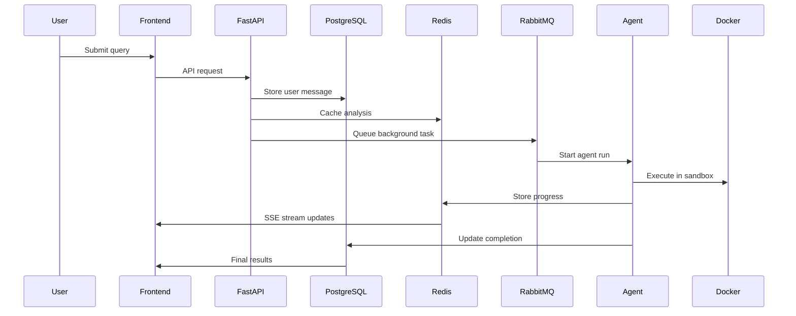
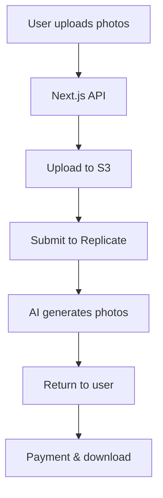
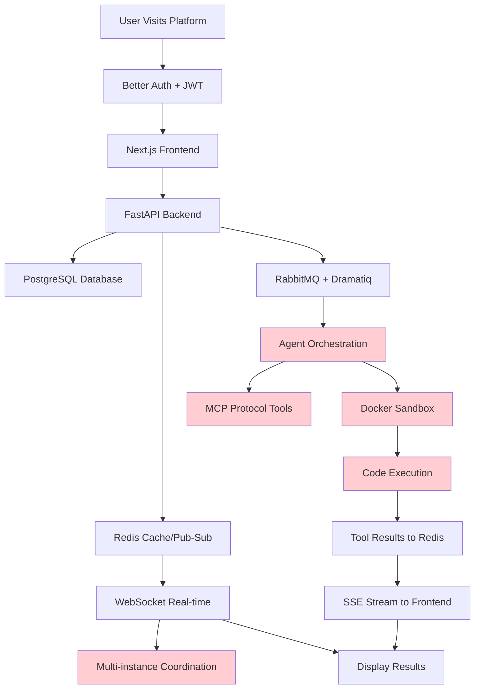
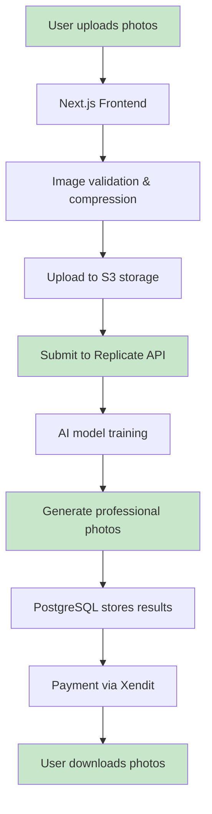

## **Mark AI Architecture (2 months, 0 users):**

## **StudioFotoAI Architecture (1 day, paying customers next week):**

Here's what 50+ pages of technical documentation taught me about shipping fast.

## The Complexity Monster That Ate My Startup

I'm a data person. I knew the market needed an AI business analyst assistant that could connect to your data warehouse and give contextual recommendations. The vision was crystal clear, the problem was real, and I had the technical chops to build it.

Then I found [Suna](https://github.com/kortix-ai/suna).

Suna was everything I wanted to build—an open-source AI data analyst with a sophisticated architecture. I dove into their codebase like it was a masterclass in building AI applications.

**What I saw was beautiful:**

- FastAPI backend with async everything
- PostgreSQL with JSONB for flexibility
- Redis for caching and pub/sub coordination
- RabbitMQ + Dramatiq for background task processing
- Server-Sent Events AND WebSocket for real-time communication
- Multi-instance coordination with Docker containers
- Agent orchestration with tool systems
- MCP protocol support for external integrations

I had to build it exactly like this. It was the "right" way.

Two months later, Mark AI existed as 50+ pages of technical documentation and zero shipped features.

## The Architecture That Killed My Momentum

Here's what my "proper" architecture looked like:

**Mark AI Complete Technical Flow:**

Looking at my actual technical documentation, here's what I built:

**The feature list that never ended:**

- Multi-provider LLM routing (OpenAI + Anthropic)
- Streaming responses with Redis coordination
- Background agent orchestration
- Microservices architecture for "scalability"
- WebSocket real-time progress tracking
- Docker sandbox execution
- Multi-instance coordination
- Custom tool system with MCP protocol

Every day I implemented one feature and discovered three more I "needed" to build.

I was building for an imaginary architecture review, not real users.

## The Brutal Reality Check

Two months in, staring at my 15-service Docker compose file, I had a moment of clarity:

**I hadn't shipped anything.**

Mark AI was a technical masterpiece that solved exactly zero real problems because nobody could use it. It lived in my GitHub repository as a monument to overengineering.

Meanwhile, I was burning through motivation and runway while competitors were shipping MVPs and getting real feedback.

**The questions that changed everything:**

- How many users want Redis pub/sub coordination? Zero.
- How many users care about my microservices architecture? Zero.
- How many users need multi-instance agent coordination? Zero.
- How many users want to PAY for ANY of this? Zero.

I was optimizing for complexity instead of customer value.

## The 180-Degree Pivot: Simplicity Wins

Instead of building the perfect AI platform, I looked for a proven model I could execute quickly.

I found PhotoAI.com by Pieter Levels—making real money with a simple concept: AI-generated professional headshots.

**The key insight:** The market was proven, the model worked, and I could focus on execution for the Indonesian market instead of inventing new architecture patterns.

**My new constraints:**

- 1 week to build MVP
- 1 week to ship it
- Use existing APIs instead of building everything

## StudioFotoAI: The Power of Boring Technology

With Claude Code as my pair programming partner, I built the entire StudioFotoAI MVP in one day.

**The "boring" StudioFotoAI architecture that actually ships:**

**No microservices. No message queues. No Docker orchestration.**

Just:

- Next.js for frontend and API routes
- PostgreSQL for simple data storage
- Replicate API for AI processing
- S3 for file storage
- Xendit for payments

## The Results Speak Louder Than Architecture

**Mark AI (2 months of "proper" engineering):**

- 50+ pages of technical documentation
- Complex multi-service architecture
- Zero users
- Zero revenue
- Still sitting in GitHub

**StudioFotoAI (1 day of focused execution):**

- Simple, documented flow
- Boring but reliable technology
- Live MVP with real users
- Payment gateway launching next week
- Actual customer feedback

The market doesn't care about your Redis pub/sub implementation. Customers don't buy your microservices. They buy solutions to their problems.

## What I Learned About "Scalable" Architecture

**The complexity trap I fell into:**

- "We need microservices for scale" (with 0 users)
- "We need real-time coordination" (for non-existent traffic)
- "We need sophisticated caching" (for queries nobody's making)
- "We need agent orchestration" (for problems nobody has)

**The reality of early-stage products:**

- Your biggest scaling problem is getting users, not serving them
- Simple architecture can handle more traffic than you think
- You can always refactor later when you have real scaling needs
- Boring technology is boring because it works

## The Questions That Save You From Overengineering

Before building any "scalable" feature, I now ask:

1. **Will customers pay for this specific feature?**
2. **Can I solve this with an existing API instead of building it?**
3. **What's the simplest version that proves value?**
4. **Am I building this for users or for my engineering ego?**

For StudioFotoAI, every technical decision optimizes for speed to market:

- Replicate API instead of training my own models
- Next.js API routes instead of separate backend
- Simple file uploads instead of complex data pipelines
- Direct payment integration instead of billing architecture

## The Indonesia Market Strategy

Instead of trying to out-engineer PhotoAI, I'm focusing on execution advantages:

**Market-specific optimizations:**

- Indonesian payment methods (Xendit integration)
- Local customer support and marketing
- Pricing optimized for Indonesian market
- Understanding of local professional photo needs

This is competing on execution and market knowledge, not technical complexity.

## From Engineer to Founder: The Mindset Shift

**Engineer mindset (Mark AI):**

- "How can I build this properly?"
- "What's the most elegant architecture?"
- "How do I handle edge cases?"
- "What if we need to scale to millions of users?"

**Founder mindset (StudioFotoAI):**

- "How quickly can I test if anyone wants this?"
- "What's the minimum that solves the problem?"
- "Can I use existing tools instead of building?"
- "How do I get the first paying customer?"

The shift from optimizing for code elegance to optimizing for customer value changed everything.

## Why I'm Sharing This Failure

Every technical founder has a Mark AI sitting in their GitHub—an overengineered project that never shipped because it was too complex to finish.

**You're not alone if you're:**

- Six months into building the "right" architecture with zero users
- Adding features faster than you're validating problems
- Optimizing for imaginary scale instead of real customers
- Building for other engineers instead of paying users

## The Simple Framework I Use Now

**Week 1:** Find a proven model, build the simplest version
**Week 2:** Ship it and get real user feedback
**Week 3+:** Iterate based on actual customer needs

Not: "Build the perfect architecture then launch."

But: "Launch the minimum viable solution, then improve."

## What's Next for StudioFotoAI

While Mark AI collects dust with its beautiful microservices architecture, StudioFotoAI is:

- Processing real user uploads
- Training AI models that generate actual photos
- Integrating payment systems for real revenue
- Getting feedback from real Indonesian customers

Simple technology solving real problems beats complex technology solving imaginary ones.

**The bottom line:** Your customers don't care about your architecture diagram. They care about whether your product solves their problem.

Stop building for the architecture review. Start building for the customer review.

---

_StudioFotoAI is live at [studiofotoai.vercel.app](https://studiofotoai.vercel.app). Building in public at [dimasmufid.com](https://dimasmufid.com). If you're a technical founder who's tired of overengineering your way to zero customers, let's connect._

**P.S.** Mark AI's codebase is still there if anyone wants to see what 2 months of overengineering looks like. It's a masterclass in how to build everything except what customers actually want.
